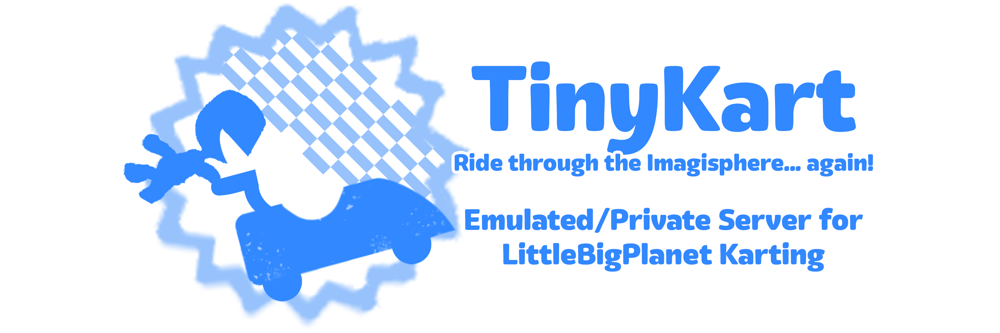

# 
WIP private server for LittleBigPlanet Karting, based off of [karting], a hybrid LBPK/MDNR server that's now defunct and was written in PHP.

---

**Q: What can you do so far?**  
A: Please look at [Features](#features) to see what has been done so far, and what is planned.

**Q: Why remake the original server?**  
A: NodeJS is faster (when well-optimized) and more modern than PHP. While [karting] uses Apache, TinyKart uses [Express], the fastest NodeJS webserver. **The original server was also abandoned for [ModnationServerEmu](https://github.com/derole1/ModnationServerEmu), which focuses *exclusively* on ModNation Racing.**

**Q: How much has carried over from that server?**  
A: If you want to be literal, nothing has. This is a complete rewrite. If you want to be technical... well, quite a bit has carried over. It's a rewrite, but it's still based off the current code. It's like putting it through a converter, sorta. Except this is all written by hand, I promise.

**Q: Can I use this with [RPCS3]/RCN?**  
A: You should only be able to use it with [RPCS3]. It technically shouldn't be possible to do this with an unmodified PS3, but hey, anything's possible.  
Please check the repository wiki for steps you need to take to connect to a TinyKart instance.  
  
**Q: Will this have a central server?**  
A: That's the end goal, yeah. But for now, you will have to self-host.

**Q: Is TinyKart associated with \<Other LittleBigPlanet Server\>?**  
A: No. TinyKart is made completely by me and me alone. I'm not associated with any other server, nor any other developers. That being said, help is *always* welcome! If you're a LBP server developer and know a thing or two about how LBPK's backend works, hit me up on Discord! (Ohana#5434)

**Q: How can I help support this project?**  
A: There's a few ways:
1. Contribute to the code!  
    If you're a Node.JS developer like me, then you might be able to help me build this server. Do note that I have *very* specific contribution guidelines, but if you think something is right, don't be afraid to show me!
2. Share it around!  
    TinyKart relies on the community to have it spread. I don't have a blog or anything like that which I can post updates on, though I do have a Twitter and a Discord. If enough people share, then surely it'll end up coming across someone who can help contribute!
3. Help create assets!  
    I'll be the first to admit, I'm not much of an artist. If you have ideas for things like website mockups, logo designs, or other UI elements such as default avatars, then *please* show them to me!

---

## Features:
Sorted in order from what's being worked on first -> what's being worked on last, it tends to be "easiest to make and most important" -> "harder to make and less important"
* [x] Basic connection (accept EULA and view friends list)
* [ ] Story Level Leaderboards
    * [x] [View Static Leaderboards](https://www.youtube.com/watch?v=EPwTjn_7nng)
* [ ] Story Level Comments
    * [x] [View Static Comments](https://www.youtube.com/watch?v=EPwTjn_7nng)

### NOTICE: Everything from here in out is sort of completely majorly broken. Might be due to something with sessions...
I'll continue to sneak around and read connection logs, try to figure out why the game is reacting the way it does. As it stands right now, the game never requests Earth data, which seems pretty integral to... literally everything below.
* [ ] Profile/Earth Viewing
* [ ] Upload Levels (Editing details comes later)
* [ ] Download Levels
* [ ] Custom Level Leaderboards
* [ ] Edit Level Details
* [ ] Copy Levels
* [ ] Custom Level Comments
* [ ] Decorate Earth
* [ ] Customize Profile
* [ ] Profile Comments
* [ ] Actual multiplayer (with friends)
* [ ] Matchmaking (This requires a remake of the BombProof server, which isn't impossible...)

### Shouldn't need Earth viewing unlike above but is still low priority
* [ ] Administrator Panel

### Optional Features:
These are in no particular order, and there's no guarantee they'll actually ever be added, because they are not necessary to the user experience at all.
* [ ] Working Announcements System (This can just be replaced with a Twitter account or Discord server)
* [ ] Discord Rich Presence (via special desktop client made specficially for TinyKart)
* [ ] Web-Based Profiles (like lbp.me had)
* [ ] IP Whitelisting (Allow users to log in only from IPs they add)
* [ ] Separate Servers for RPCN and PSN (Do not hold your breath on this one)
* [ ] Import Data from [Project Lighthouse](https://github.com/LBPUnion/ProjectLighthouse) (after it releases to the public)
* [ ] New/Updated Profanity Filter (add new terms that might not have been in before, such as more obscure slurs and filter evades)
* [ ] Add [ElasticStack](https://www.elastic.co/elastic-stack/) Support
* [ ] Server-Side Profanity Check

---

## Requirements
* [NodeJS v14+](https://nodejs.org/en/download/)  
* NPM/Yarn ([Yarn](https://yarnpkg.com/getting-started/install) recommended) 
    * If using Yarn, only [Yarn 2+](https://yarnpkg.com/getting-started/migration) is officially supported.
* Bash Shell ([Git Bash](https://git-scm.com/downloads) works perfectly fine for this)  
* Basic understanding of SQLite 3

---

## Running
0. Clone the repository:
    ```console
    $ git clone https://github.com/AutumnRivers/TinyKart.git
    ```

1. Install the dependencies:
    ```console
    $ yarn --ignore-optional
    ```
    `npm install` works as well.  
    Remove `--ignore-optional` if you plan to follow step 5 and use PM2 to keep the server running even during crashes. Do note, it's a BIG INSTALL.

2. Rename `database_template.sqlite` to `database.sqlite`:
    ```console
    $ mv database_template.sqlite database.sqlite
    ```
    If you're on Windows, use Powershell!

3. Generate HTTPS/SSL certificates for the Secure API
    1. [Install mkcert](https://github.com/FiloSottile/mkcert/blob/master/README.md#installation)
    2. Run the following code:
        ```console
        $ mkcert localhost
        ```
        (If hosting on a public server with a hostname such as `example.com` then change localhost to your hostname)
        * You most likely will get an error about the certificate being self-signed in major browsers, which will prevent you from visiting the page. Don't panic, the game doesn't check for certificate issues, so it doesn't matter.
    3. Place the files `localhost-key.pem` and `localhost.pem` in the `/security` folder.

4. Start the server:
    ```console
    $ yarn start
    ```
    Or, if you'd prefer to have everything logged to a file:
    ```console
    $ yarn startlogs
    ```
    If using NPM:
    ```console
    $ npm run startlogs
    ```

5. OPTIONAL: If you'd like to keep the server running even when it crashes, you can install `pm2`. If you didn't add `--ignore-optional` to your original install command, you can run pm2 with the following command:
    ```console
    $ yarn startpm2
    ```
    Do note that there is no option to save to a log here, but [PM2 automatically outputs everything to a log file](https://stackoverflow.com/a/55828215/9146479).

And that's all, the server should now be running.

---

# Legal Notice
I am not associated or affiliated with Sony Entertainment, Media Molecule, or any other teams that worked on LittleBigPlanet™ Karting. I have never once worked for any of these teams, as well, so this is all original code that has been reverse-engineered from [LittleBigArchive's Packet Captures](https://littlebigarchive.com/LittleBigPlanet-Karting/).

---

[karting]: https://github.com/Gamer4647/karting-archive
[Express]: https://www.npmjs.com/package/express
[RPCS3]: https://rpcs3.net/